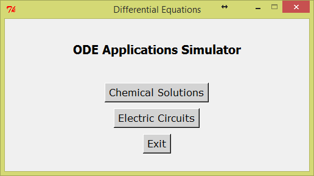
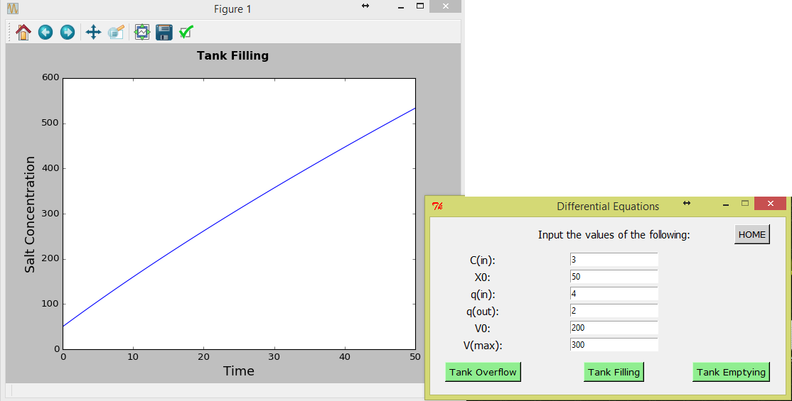
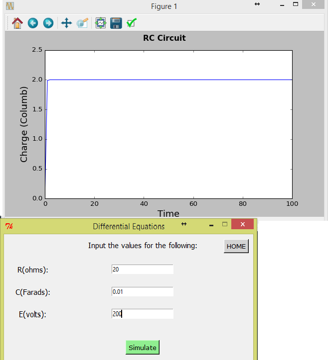

# ODE Applications Simulator
**Description:**

This program is made to obtain values of salt concentration of a chemical solution as a functions of time following different tank conditions: filling, overflowing and emptying. As these conditions require another differential equation to solve, this program conveniently does the simulation of X(salt concentration) and t (time) at different conditions once user entered all the required inputs

**Sample Output**

